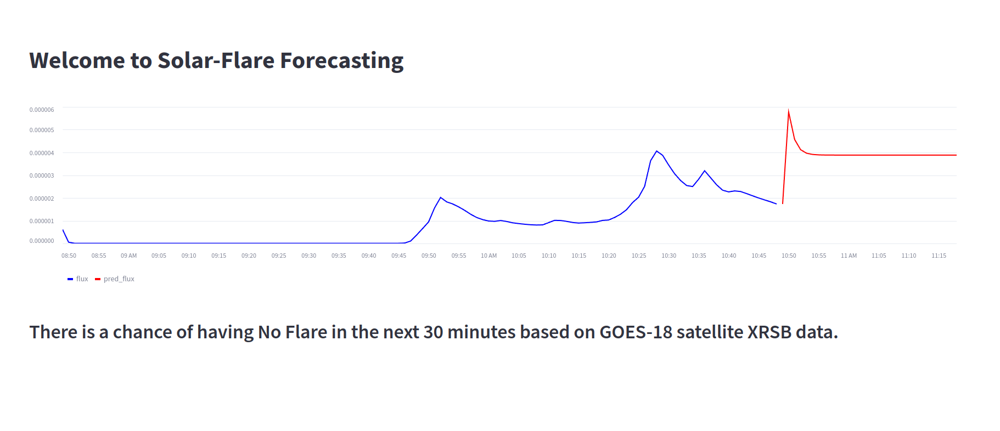

# Welcome to solar flare predictions

## What you will find in this repository
- The source code for different experiments can be found in the experiemnts folder
- The source code for realtime model running can be found src folder

###  Setup
Create a virtual environment and install requirements.txt file. Follow the command below for Ubuntu  22.04
```
python -m venv venv; 
source bin/activate;
python -m pip install -q --upgrade pip;
python -m pip install -qr requirements.txt  
```
 Run the streamlit app (being at the repository root):
```
streamlit run src/app.py
```       
After the successfull run, the running interface can be found in this URL 
```
http://localhost:8501
```

